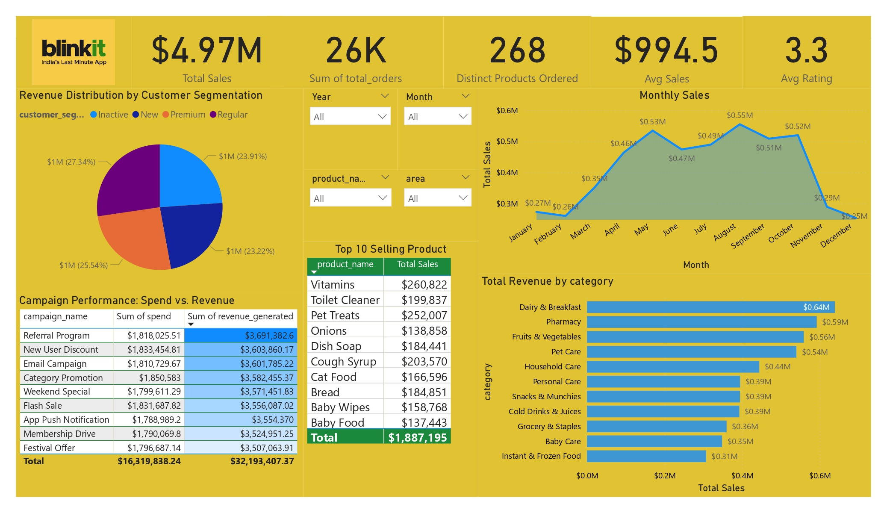

# Blinkit_Sales_Analysis
 A brief overview of the analysis, its purpose, and the data source.
 
&nbsp;
This is an exciting project I had prepared to push my limits in Power BI. 

## Project Overview
This project provides a comprehensive analysis of Blinkit's sales data to derive actionable insights and recommendations for optimizing sales strategies and boosting revenue. The analysis covers key aspects such as total sales, customer segmentation, monthly sales trends, product performance, category analysis, and campaign effectiveness. The goal is to identify opportunities for growth and improvement in Blinkit's business operations.
## Tool used :
&nbsp; 
## Key Insights:
•	Total Sales and Orders: Total sales are $4.97M, derived from 26K orders.
•	Average Sales: The average sales are $994.5.
•	Product Orders: 268 distinct products were ordered.
•	Customer Segmentation: The revenue distribution across customer segments is as follows: 
   Inactive - $0.6M, New - $1M (23.91%), Premium - $1M (25.54%), and Regular - $1M (23.22%).
•	Top Selling Products: The top 3 selling products are Vitamins ($260,822), Pet Treats 
   ($252,007), and Cough Syrup ($203,570).
•	Campaign Performance: The "Referral Program" generated the highest revenue ($3,691,382.6) with 
  a spend of $1,818,025.51.
•	Monthly Sales Trend: Sales have generally increased from January ($0.3M) to May ($0.55M) but 
  show fluctuations in between.
•	Top Categories: "Dairy & Breakfast" is the top revenue generating category.

## Recommendations to Grow Sales and Revenue:
•	Focus on High-Revenue Customer Segments: Premium customers contribute the highest revenue 
  (25.54%). Implement targeted marketing and loyalty programs to retain and further engage these 
  high-value customers.
•	Optimize Marketing Campaigns: The "Referral Program" has the highest return on investment. 
  Increase investment in this program and analyze its success factors to replicate in other 
  campaigns.
•	Boost Sales of Top Products: Vitamins, Pet Treats, and Cough Syrup are the top-selling 
  products. Consider strategies such as bundled offers, discounts, and prominent placement on the app to further drive sales.
•	Improve Sales in Underperforming Months: Analyze the reasons for lower sales in February, 
  March, and April. Implement targeted promotions or campaigns during these months to boost 
  revenue.
•	Category Performance Analysis: "Dairy & Breakfast" is the top category. Analyze the 
  performance of other categories like "Pharmacy" and "Baby Care" and identify opportunities for 
  improvement through targeted promotions or product assortment optimization.

## Dashboard :
&nbsp;
